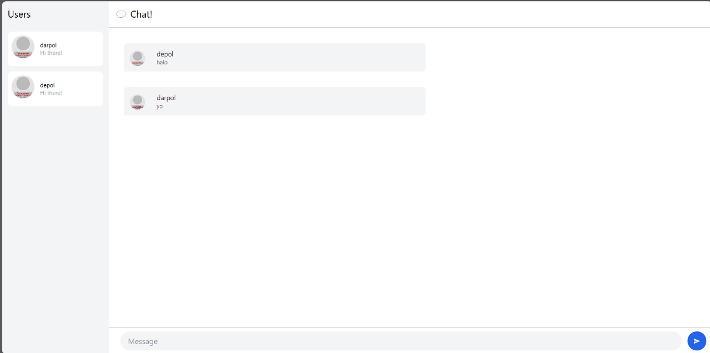

### 3.1. Original code

Pertama dilakukan clone terhadap base code dari yewchat dan websocket.

### 3.2. Be Creative

Dilakukan perubahan background pada welcome page. Hal ini dilakukan dengan menaruh background image. Hal ini dilakukan dengan mengedit `login.rs` dan menambahkan gambar pada index.html.

Perhatikan bahwa hal yang serupa juga dibuat untuk bagian chatnya.

